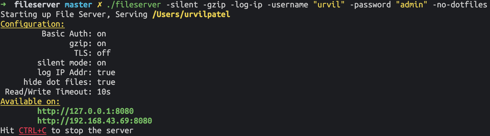
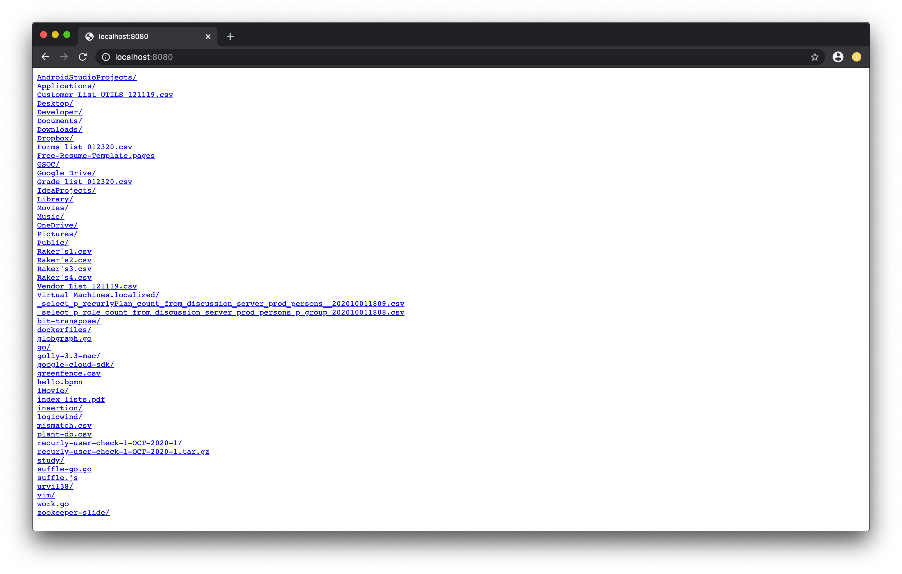

# Fileserver




# Build

- If you want to build opa-iptables right away, you need a working [Go environment](https://golang.org/doc/install). It requires Go version 1.12 and above.

```
$ git clone https://github.com/urvil38/fileserver.git
$ cd fileserver
$ make
```
